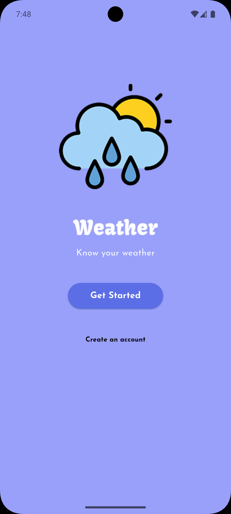
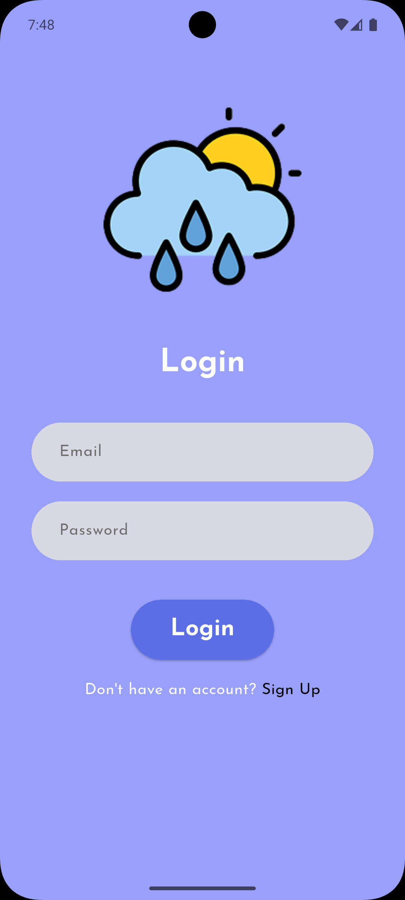
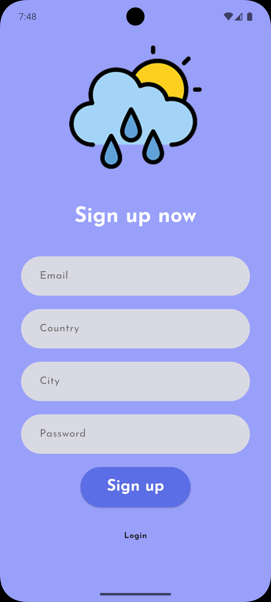
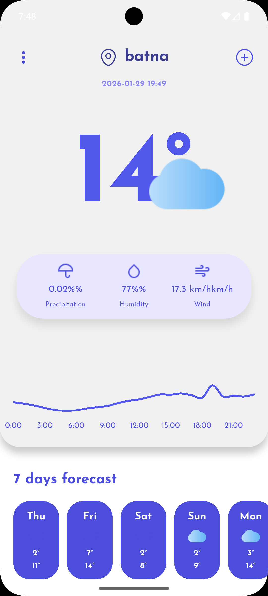
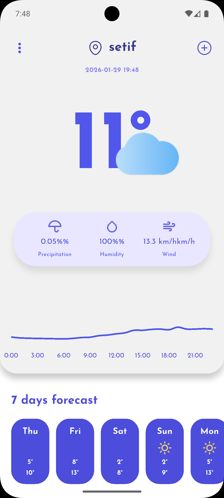
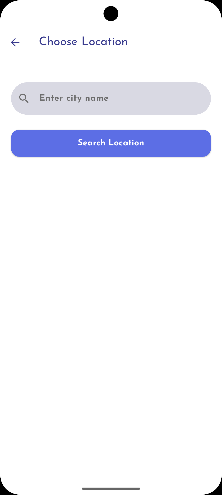

# Weather App 

A modern, feature-rich Weather Application built with Flutter, following Clean Architecture principles. This app provides real-time weather updates, detailed forecasts, and location management, based on the [Community Design](https://www.figma.com/design/xDUE0Y2MmYXrf3WZjo2HwC/Weather-App-Design--Community-?node-id=0-1&p=f&t=IvTy2UR3KOQ6exT5-0) on Figma.

## 📱 Features

-   **Authentication**: Secure User Login and Sign Up powered by **Firebase Auth**.
-   **Real-time Weather**: Current weather conditions for any location using **WeatherAPI**.
-   **7-Day Forecast**: Detailed daily weather predictions.
-   **Hourly Analytics**: Visual hourly weather graphs using `fl_chart`.
-   **Location Management**: Save and manage multiple favorite locations (stored locally via `sqflite`).
-   **Clean Architecture**: Modular and testable codebase separated into Data, Domain, and Presentation layers.
-   **State Management**: Robust state handling using **Bloc/Cubit** pattern.

## 🛠 Tech Stack

-   **Framework**: Flutter
-   **Language**: Dart
-   **Architecture**: Clean Architecture
-   **State Management**: `flutter_bloc`
-   **Dependency Injection**: `get_it`
-   **Networking**: `http`
-   **Local Database**: `sqflite`
-   **Authentication**: `firebase_auth`
-   **Environment Config**: `flutter_dotenv`
-   **UI Components**: `fl_chart`, `iconsax`, Custom Fonts (Josefin Sans)

## 📂 Project Structure

The project is organized by features, adhering to Clean Architecture:

```
lib/
├── core/                   # Core utilities, constants, theme, and errors
├── features/
│   ├── auth/               # Authentication feature (Data, Domain, Presentation)
│   ├── location/           # Location management (Data, Domain)
│   └── weather/            # Weather display feature (Data, Domain, Presentation)
├── main.dart               # App entry point
└── service_locator.dart    # Dependency Injection setup
```

## 🚀 Getting Started

Follow these steps to set up and run the project locally.

### Prerequisites

-   [Flutter SDK](https://flutter.dev/docs/get-started/install) installed.
-   A [WeatherAPI.com](https://www.weatherapi.com/) API key.
-   A [Firebase](https://firebase.google.com/) project configured.

### Installation

1.  **Clone the repository:**
    ```bash
    git clone https://github.com/yourusername/weather_app.git
    cd weather_app
    ```

2.  **Install dependencies:**
    ```bash
    flutter pub get
    ```

3.  **Environment Setup:**
    Create a `.env` file in the root directory and add your WeatherAPI key:
    ```env
    API_KEY=your_api_key_here
    ```

4.  **Firebase Configuration:**
    Ensure you have your `firebase_options.dart` configured or add your `google-services.json` (Android) and `GoogleService-Info.plist` (iOS) to the respective folders if not using the generated options file.

5.  **Run the App:**
    ```bash
    flutter run
    ```

## 📸 Design








## 📄 License

This project is licensed under the MIT License - see the [LICENSE](LICENSE) file for details.
